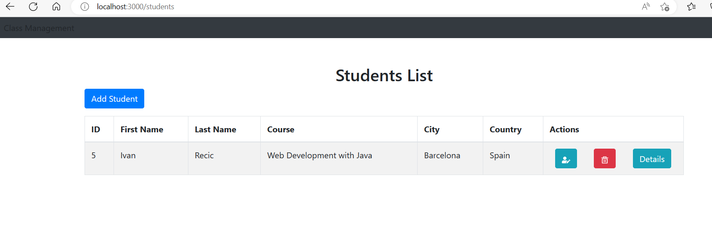

# class-management application
Simple fullstack Spring Boot and React app for students management:

## Tech stack
- Java 17
- Spring Boot
- Hibernate
- Lombok
- MySQL 
- Flywaydb
- BuildTool - Gradle
- UI: ReactJs framework
- Docker compose

## Run
Dev: 
- run frontend by `npm start`
- run backend with `dev` profile

Docker compose:

- Use for start:
`docker-compose up`

- Use for stop:
`docker-compose stop`

