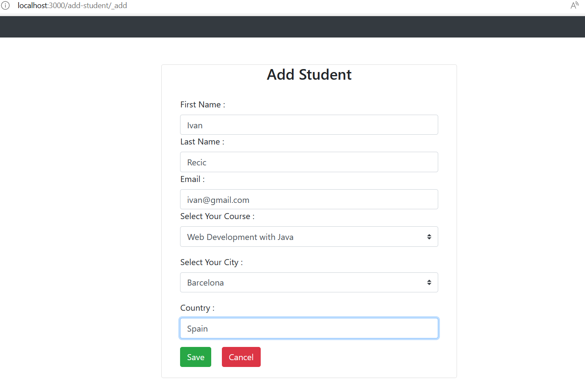

# class-management application
Simple fullstack Spring Boot and React app for students management:

## Tech stack
- Java 17
- Spring Boot
- Hibernate
- Lombok
- MySQL 
- Flywaydb
- BuildTool - Gradle
- UI: ReactJs framework

## Run
`docker-compose up`

